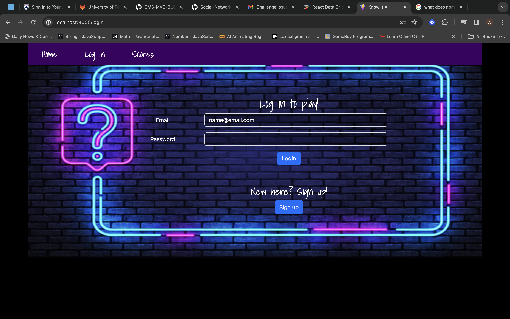

# Know It All Trivia Games

## License
This project is licensed under the [MIT License] - see [LICENSE](LICENSE) file for more details.

## Description
Know It All is a Trivia Game that uses the Open Trivia Database that presents users with ten trivia questions based on eight categories: Art, Books, Computers, Film, History, Science & Nature, Sports, and TV. Sounds and colors indicate whether the user answered each question correctly or incorrectly. When the user logs in, all of their quiz scores are saved to their account.

## Table of Contents
- [License](#license)
- [Description](#description)
- [Demonstration](#demonstration)
- [Screenshots](#screenshots)
- [Usage](#usage)
- [Technologies](#technologies)
- [Contributors](#contributors)
- [Credits](#credits)
- [Deployments](#deployments)

## Demonstration

[Click Here to View Video Demonstration](./client/src/assets/Art-Trivia-Demo.mp4)

## Screenshots

 

## Usage

### Install

- Clone or Fork the repository from Github to your local machine.
- Open using a source code editor like VScode.
- Open the integrated terminal in the root directory and type the command `npm install` to make the necessary dependency installations. 

### Start the Server

- In the terminal enter `npm run seed` to seed the database.
- Next, in the terminal enter `npm run build` to prepare the application for deployment using `vite v4.5.2` build.
- When prior steps are completed successfully, enter the command `npm run start` opening Graphql in browser. 
- Open Graphql to use queries for existing data, or add new data via mutations within the database.
- Enter in the terminal `npm run develop` to open the application in browser.
- The application will be running at http://localhost:3001 

### App Browser Navigation

1. Once on the landing page, click the "Get started" button to be directed to the login/signup page.
2. Complete one of either the login or signup form and submit. 
3. User will be re-directed to the landing page where they can choose from 8 different categories.
4. Upon choosing a category, the user starts the trivia game with questions that each have a 15 second countdown.
5. When trivia game ends, the user is presented with their score and the two options to "save score" or "play again."
6. The user can check their personal scores by choosing the "Scores" option in the navigation bar.
7. On the Scores Page a table with the user's name, date created, and score are presented for viewing.
8. The user can Log Out by clicking the "Log Out" option in the navigation bar and will be directed back to the landing page.

## Technologies

### Express [Version 4.18.2](https://expressjs.com/)

### Mongoose [Version 8.1.2](https://www.npmjs.com/package/mongoose)

## Contributors
- **[Ashley Hill](https://github.com/ashleyh5440)** - Front end/Back end Development
- **[Angel Gonzalez](https://github.com/Utero93)** - Front end Development
- **[Courtney Kalbach](https://github.com/KNC2007)** - Front end/Back end Development
- **[Mari Bah](https://github.com/Mariatu)** - Back end Development
- **[Alex E](https://github.com/upennbootcamp23)** - Front end/Back end Development

## Credits
The crew would like to give special thanks to:
- Professor Anthony Maddatu, Teaching Assistants Tom Woods and Andrew Read for their help in fixing up bits and pieces of the project
- The PBS KIDS Style Guide, which was used to do the CSS coloring (albeit temporarily): https://pbs-kids-brand.pbskids.org/downloads/pbs-kids-style-guide.pdf

## Deployments
The link to the deployed project is https://art-trivia-game.onrender.com/.
